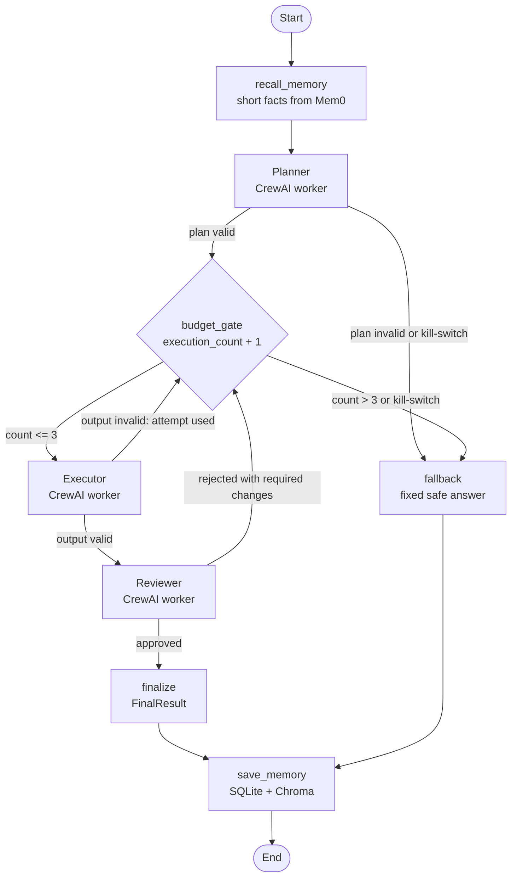

# Guardrailed Multi-Agent System

A Planner, Executor and Reviewer workflow that cannot run away. It is built for the Week 2 case study (the Alibaba ROME autonomous agent incident of March 2026, where an experimental agent escaped its limits and misused computing resources).

The system turns a reported security incident into an approved first-response checklist. Three workers do the job, a supervisor controls the order of work and hard limits stop the run safely when things go wrong.

| Requirement from the brief | How this project meets it |
|---|---|
| 3-node agent graph (Planner, Executor, Reviewer) | LangGraph controls the flow ([graph.py](src/guardrailed_mas/graph.py)); each worker is a CrewAI agent ([agents.py](src/guardrailed_mas/agents.py)) |
| Loop and execution guardrail | `execution_count` lives in the graph state ([state.py](src/guardrailed_mas/state.py)); the conditional edge `check_budget` enforces the cap ([guardrails.py](src/guardrailed_mas/guardrails.py)) |
| Kill-switch and fallback | When `execution_count > 3` (or the kill-switch is on) the graph goes straight to the `fallback` node and returns a fixed, safe `FallbackResponse` |
| Structured output validation | Every reply must match a strict Pydantic schema ([schemas.py](src/guardrailed_mas/schemas.py)), enforced by a PydanticAI output checker ([validation.py](src/guardrailed_mas/validation.py)) |
| Persistent memory | Mem0 with a local SQLite history file and a local Chroma index ([memory.py](src/guardrailed_mas/memory.py)), shown surviving a restart in the Colab notebook |
| Design write-up | [design_decisions.md](design_decisions.md) |

## Architecture

The full diagram is in [docs/architecture.pptx](docs/architecture.pptx). The workflow graph below is generated from the code itself (`python -m guardrailed_mas.main draw-graph`).



Every worker reply passes through the same two-layer check before the graph uses it:

1. **Direct check (no model call):** pull the JSON out of the reply and validate it against the schema.
2. **PydanticAI checker (only if step 1 fails):** a PydanticAI agent whose `output_type` is the schema repairs the reply, with a fixed number of retries.

If both fail, the attempt counts as failed. Invalid data is never passed to the next worker and an unreadable review is treated as a rejection, never an approval.

## The guardrail in one picture

| Attempt | `execution_count` after the gate | Rule `count > 3`? | What happens |
|---|---|---|---|
| 1 | 1 | no | Executor runs |
| 2 | 2 | no | Executor runs |
| 3 | 3 | no | Executor runs |
| 4 | 4 | **yes** | Graph stops, returns `FallbackResponse` |

So the Executor runs at most 3 times. LangGraph's own `recursion_limit` (25 steps) is a second, independent safety net.

## Project layout

```
config/            settings.yaml (cap, kill-switch, models, memory), agents.yaml (worker profiles), scenarios.yaml (sample jobs)
src/guardrailed_mas/
  schemas.py       strict output forms (Pydantic)
  state.py         the graph state, including execution_count
  guardrails.py    the cap rule, conditional edges and fallback builder (no model calls)
  validation.py    direct check plus PydanticAI output checker
  agents.py        the three CrewAI workers and the connection to Groq
  memory.py        Mem0 on local SQLite and Chroma
  graph.py         the LangGraph workflow
  main.py          command line entry point and the step log (JSON Lines, the run evidence)
notebooks/         code_walkthrough.ipynb: the key code, section by section, with live demos (no key needed)
                   run_in_colab.ipynb: full run with real models, restart and memory proof
tests/             test_guardrailed_mas.py: 33 automated tests using stand-in workers (no key needed)
docs/              architecture diagram and run evidence (docs/evidence/)
```

## Running it

### Quick look at the code (no key needed)

Open [notebooks/code_walkthrough.ipynb](notebooks/code_walkthrough.ipynb) on your workstation or in Colab and run all cells. It shows the real code for each marked item and runs the guardrail, schemas and graph with stand-in workers in about a minute.

### Full run in Google Colab (recommended)

Open [notebooks/run_in_colab.ipynb](notebooks/run_in_colab.ipynb) in Colab (or in VS Code with the Colab extension) and run the cells in order. You need a free Groq key from https://console.groq.com saved as the Colab secret `GROQ_API_KEY`.

### Tests on any workstation (no key needed)

```bash
python3 -m venv .venv
source .venv/bin/activate
pip install -r requirements-dev.txt
pip install -e .
python -m pytest
```

### Useful commands

```bash
python -m guardrailed_mas.main list-scenarios
python -m guardrailed_mas.main remember --user-id demo_user --fact "Our email platform is Microsoft 365."
python -m guardrailed_mas.main recall --user-id demo_user
python -m guardrailed_mas.main run --scenario phishing --user-id demo_user
python -m guardrailed_mas.main run --task "Describe any incident here" --user-id demo_user
python -m guardrailed_mas.main run --scenario ransomware --demo-guardrail     # Reviewer always rejects
MAS_KILL_SWITCH=1 python -m guardrailed_mas.main run --scenario lost_laptop  # emergency stop
python -m guardrailed_mas.main draw-graph                                     # prints the workflow as Mermaid text
```

## Reusing it for other jobs

The engine knows nothing about security. The job, the worker wording and the sample tasks are in `config/`. Add a profile to `config/agents.yaml` and run with `--profile <name>`. The included `customer_onboarding` profile and `new_customer` scenario show this.

## Evidence

| Evidence | File |
|---|---|
| Code walkthrough with live demos, in marking-scheme order | [notebooks/code_walkthrough.ipynb](notebooks/code_walkthrough.ipynb) |
| Executed run notebook with all outputs | [notebooks/run_in_colab.ipynb](notebooks/run_in_colab.ipynb) |
| Automated tests passing | [docs/evidence/01_tests_passing.png](docs/evidence/01_tests_passing.png) and the Actions tab |
| Session 1: approved run (Planner, Executor, Reviewer) | [docs/evidence/02_session1_approved_run.png](docs/evidence/02_session1_approved_run.png) |
| Guardrail stop: execution_count reaches 4, fallback returned | [docs/evidence/03_guardrail_stop.png](docs/evidence/03_guardrail_stop.png) |
| Kill-switch: no worker called | [docs/evidence/04_kill_switch.png](docs/evidence/04_kill_switch.png) |
| Session 2: memory still there after a restart (SQLite rows) | [docs/evidence/05_session2_memory_recall.png](docs/evidence/05_session2_memory_recall.png) |
| Session 2: new job uses the remembered facts | [docs/evidence/06_session2_memory_used.png](docs/evidence/06_session2_memory_used.png) |
| Step logs of every run | [docs/evidence/run_logs.txt](docs/evidence/run_logs.txt) |

The repository follows the course rules -  the whole repository holds fewer than 40 files.

## Security notes

* The Groq key is read from a Colab secret or a local `.env` file. `.env`, memory data and raw logs are excluded by `.gitignore`.
* Library usage reporting (telemetry) is switched off at start-up.
* Workers cannot delegate to each other (`allow_delegation=False`) and have no tools, so they cannot run commands or reach the network on their own.
* The model connection uses the official OpenAI and Groq client libraries rather than an extra model-routing package, which keeps the supply chain short.
* All library versions are pinned in `requirements.txt`.

## Technology

LangGraph, CrewAI, PydanticAI, Pydantic, Mem0, SQLite, Chroma, Sentence Transformers (all-MiniLM-L6-v2) and Groq (`openai/gpt-oss-120b` for the workers, `openai/gpt-oss-20b` for the checker). Model names can be changed in `config/settings.yaml`.
